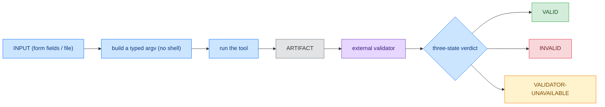
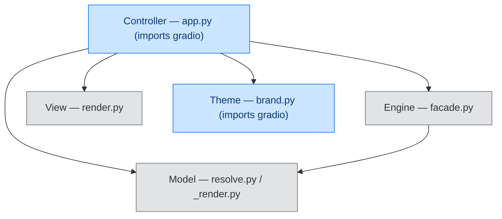

# BreachSAFE EnXemble

[](CHANGELOG.md)
[](https://www.python.org/downloads/)
[](LICENSE)
[](https://docs.astral.sh/ruff/)
[](https://mypy-lang.org/)
[](https://securityscorecards.dev/viewer/?uri=github.com/paul007ex/breachsafe-ux)

BreachSAFE EnXemble is a generic, config-driven UX host for command-line tools. Declare any CLI
tool's parameters in one YAML descriptor and the host renders a web tab, runs the tool, validates
its output with an external validator, and reports a three-state verdict: VALID, INVALID, or
VALIDATOR-UNAVAILABLE. It never shows a green result the validator did not actually give.

Adding a tool is a YAML file, not new UI code. The renderer, the runner, and the badge are
written once in the engine and shared by every tool tab, so the host stays tool-agnostic. The
packaged `qureddy-ux` image used in the examples below is one **shipped reference example** of the
host with a specific tool bundled in; any other tool wraps the same way.

## Architecture at a glance

Every tab is the same pipeline with different nouns: input, run, artifact, external validator,
three-state verdict:



The host is a small MVC around that engine and a theme layer; only the controller and theme import
the web framework:



See [architecture](docs/explanation/architecture.md) and
[the Gradio shell](docs/explanation/the-gradio-shell.md) for the full module map.

## Contents

1. [Quickstart with Docker](#1-quickstart-with-docker)
2. [Run from source](#2-run-from-source)
3. [Open the UI and run](#3-open-the-ui-and-run)
4. [Add your own tool](#4-add-your-own-tool)
5. [Interpret the verdict](#5-interpret-the-verdict)
6. [Execution backends](#6-execution-backends)
7. [Configuration](#7-configuration)
8. [Requirements](#8-requirements)
9. [Documentation and support](#9-documentation-and-support)
10. [Contributing](#10-contributing)
11. [License](#11-license)

## 1. Quickstart with Docker

Docker is the primary way to run a tool-UX and the fastest path to a result. A tool-UX image
bundles the host and its tools, so a single `docker run` serves the UI with the tools already
resolvable. Using the shipped reference example image:

```bash
docker rm -f $(docker ps -aq --filter publish=7860) 2>/dev/null   # clear any previous run on :7860
docker run -d --pull=always -p 7860:7860 --name enxemble ghcr.io/paul007ex/qureddy-ux:latest
sleep 10 && open http://localhost:7860       # macOS  ·  Linux: xdg-open  ·  Windows: start
```

The first line clears any container already on port 7860; `--pull=always` fetches the newest
image; the third opens your browser once the host is up (macOS `open`; Linux `xdg-open`; Windows
`start`). No login, no Docker socket, multi-arch (Intel and Apple Silicon). Stop it with
`docker stop enxemble`. See [run with Docker](docs/how-to/run-with-docker.md) for tags, digest
pinning, and configuration.

## 2. Run from source

Run the host from a source checkout to develop it, wrap a tool that has no prebuilt image, or
point it at your own descriptors. EnXemble is **not** published to PyPI or TestPyPI; install it
from source with [`uv`](https://github.com/astral-sh/uv):

```bash
git clone https://github.com/paul007ex/breachsafe-ux && cd breachsafe-ux
uv sync                          # runtime only (enough to launch)
uv run breachsafe-ux             # serves http://127.0.0.1:7860
uv run breachsafe-ux --check     # resolve every tab's tool + validator (exit != 0 if any is missing)
```

The tools a descriptor names are resolved on `PATH` (with a Docker-image fallback when a
descriptor declares one). See [run from source](docs/how-to/run-from-source.md) for making tools
resolvable and pointing the host at your own descriptor directory.

## 3. Open the UI and run

Open the host in your browser. You land on the first tab with its fields prefilled with a working
example, so you can run immediately: edit the fields, click the tab's run button, and read the
badge. The [first-run tutorial](docs/tutorials/your-first-scan.md) walks through it end to end.
The shipped example tabs wrap a post-quantum readiness scanner; for what those scans mean, see
the [`breachsafe/qureddy` documentation](https://github.com/breachsafe/qureddy).

## 4. Add your own tool

Wrap any command-line tool from **one YAML descriptor** at `tools/<id>/<id>.yaml`. Each input
maps to argv by exactly one of `positional`, `arg`, or `flag`; the descriptor also declares how
the tool runs, its external validator, and the badge rule. Adding a tool changes no host code.

```yaml
id: mytool
title: "My Tool"
standalone: true
inputs:
  - { name: source, type: text, label: "source", required: true, arg: "--source" }
  - { name: fast, type: bool, label: "fast mode", default: false, flag: "--fast", group: advanced }
run:
  base: [mytool, scan]
  artifact_from: stdout
  artifact_name: out.json
validate:
  argv: ["{python}", "-c", "import json,sys; json.load(open('{artifact}')); sys.exit(0)"]
  badge_rule: { pass_if: { exit: 0 }, fail_if: { exit: 1 }, otherwise: unavailable }
```

The full recipe (with a generic worked example) is [add a tool](docs/how-to/add-a-tool.md); every
field is in the [descriptor schema](docs/reference/descriptor-schema.md) and the argv tokens are
in [descriptor tokens](docs/reference/descriptor-tokens.md).

## 5. Interpret the verdict

The badge reports the result of an external validator as one of three states, and never a green
the validator did not give:

| State | Meaning |
|---|---|
| VALID | the validator ran and accepted the artifact |
| INVALID | the validator ran and rejected the artifact |
| VALIDATOR-UNAVAILABLE | the tool or validator could not run (missing dependency, Docker down, timeout, empty output) |

A crashed tool, a missing validator, or an empty run all resolve to VALIDATOR-UNAVAILABLE. Colour
is a redundant cue only; the word carries the state. See
[the three-state verdict](docs/explanation/three-state-verdict.md) and the
[badge reference](docs/reference/badge.md).

## 6. Execution backends

A descriptor chooses how its tool runs; the "could not run" path is shared, so a backend that
cannot run yields VALIDATOR-UNAVAILABLE rather than a false verdict.

| Backend | Descriptor | Portable | Isolated | Status |
|---|---|---|---|---|
| Local binary | `run.base` on PATH | no | no | supported (preferred when present) |
| Docker image | `run.image` (`docker run --pull=always`) | yes | yes | supported |
| Remote API | `run.endpoint` | yes | yes | future |

A descriptor can declare both `run.base` and `run.image`: the host runs the local binary when it
resolves on PATH and falls back to the image otherwise. See
[execution backends](docs/reference/execution-backends.md). Multi-tool orchestration is out of
scope by design.

## 7. Configuration

The host is configured by environment variables.

| Variable | Default | Purpose |
|---|---|---|
| `BREACHSAFE_UX_PORT` | 7860 | server port |
| `BREACHSAFE_UX_HOST` | 127.0.0.1 (0.0.0.0 in Docker) | bind address |
| `BREACHSAFE_UX_TOOLS_DIR` | bundled `tools/` | descriptor root |
| `BREACHSAFE_UX_RUN_ROOT` | `~/mint-proof/wizard-runs` | per-run scratch (macOS: keep under `/Users` for Docker) |
| `BREACHSAFE_UX_<FLAG>` | on | hide a `feature_flag`-gated tab with `false` |

Full details, including feature flags, are in the
[environment variables reference](docs/reference/environment-variables.md) and
[enable optional tabs](docs/how-to/enable-optional-tabs.md).

## 8. Requirements

- Python 3.12 or newer, with `uv`, to run from source.
- Docker, to run a tool-UX image or when a descriptor uses the image backend or a Docker-based
  validator.
- Each wrapped tool has its own requirements and carries its own licence.

## 9. Documentation and support

- [Documentation index](docs/README.md)
- [Your first run](docs/tutorials/your-first-scan.md)
- [Add a tool](docs/how-to/add-a-tool.md) · [Descriptor schema](docs/reference/descriptor-schema.md)
- [Architecture](docs/explanation/architecture.md) · [Why the host is agnostic](docs/explanation/why-agnostic.md)
- [Architecture decision records](docs/adr/) · [Known issues](docs/KNOWN-ISSUES.md)
- [Security policy and private disclosure](SECURITY.md)
- [Public issue tracker](https://github.com/paul007ex/breachsafe-ux/issues)

Do not file security vulnerabilities in the public issue tracker. Follow
[`SECURITY.md`](SECURITY.md) for private reporting.

## 10. Contributing

See [`CONTRIBUTING.md`](CONTRIBUTING.md) and the
[contributor documentation](docs/contributors/). The repository enforces formatting, lint, strict
type checking, tests, security scans, dependency audits, architecture layering, license metadata,
file size policy, and release-artifact checks. Reproduce every blocking check locally with
`uv run --locked --extra dev python scripts/release_gate.py`.

## 11. License

Apache License 2.0 (OSI-approved open source). You may use, modify, distribute, and use it
commercially under the terms of the licence. See [`LICENSE`](LICENSE), [`LICENSES/`](LICENSES/),
and [`REUSE.toml`](REUSE.toml). The tools it fronts carry their own licences.
