<!-- SPDX-FileCopyrightText: 2026 BreachSAFE <https://www.breachsafe.io> -->
<!-- SPDX-License-Identifier: Apache-2.0 -->
# Review process

How a change lands, and what a reviewer checks before it does. This is the operational form of
[`CONTRIBUTING.md`](../../CONTRIBUTING.md) §3 (workflow), §4 (quality gates), and §8 (commits),
which remain authoritative.

## Contents

1. [The flow](#1-the-flow)
2. [The reviewer checklist](#2-the-reviewer-checklist)
3. [Commits](#3-commits)
4. [Security](#4-security)

## 1. The flow

```mermaid
flowchart LR
    issue([Open an issue]) --> branch([Branch from main<br/>type/short-description])
    branch --> code([Write the change<br/>one thing per PR])
    code --> gate["Run the local release gate"]
    gate --> pr([Open a PR<br/>fill the template])
    pr --> selfreview["Self-review your own diff"]
    selfreview --> review["Reviewer checklist"]
    review --> ci{CI green?}
    ci -->|yes| merge([Squash-and-merge])
    ci -->|no| code
    classDef process     fill:#cce5ff,stroke:#0d6efd,color:#0a3678;
    classDef artifact    fill:#e2e3e5,stroke:#6c757d,color:#2f3336;
    classDef valid       fill:#d4edda,stroke:#28a745,color:#155724;
    class issue,branch,code,pr process;
    class gate,selfreview,review artifact;
    class merge valid;
```

The steps in order:

1. **Open an issue first** for non-trivial work, so scope is confirmed before code.
2. **Branch from `main`.** Branch naming is `<type>/<short-description>` (for example
   `feat/descriptor-tokens`, `fix/badge-state-parse`). Never commit directly to `main`.
3. **One thing per PR.** Do not bundle a refactor with a feature with a bug fix.
4. **Run the [local release gate](local-release-gate.md)** before pushing. It reproduces every
   blocking CI check and fails closed on the first breach.
5. **Open a PR**, fill out the template, and **self-review your own diff** first.
6. **CI must pass** before merge. **Squash-and-merge** is the default.

## 2. The reviewer checklist

A reviewer confirms the automated gates are green and then checks the things a gate cannot. Work
through this list on every PR.

### Gates

- [ ] Every blocking gate passed. CI runs the full suite in
      [`CONTRIBUTING.md`](../../CONTRIBUTING.md#4-quality-gates) §4; the same set runs locally
      through [`scripts/release_gate.py`](../../scripts/release_gate.py). A red gate blocks merge;
      it is never waived by lowering a threshold or adding a blanket `noqa`.
- [ ] No gate was weakened to pass. A lowered coverage floor, a new broad ignore, or a skipped
      test in the diff is itself a review finding.

### Boundary

- [ ] The change is on the correct side of the
      [host-descriptor boundary](../explanation/host-descriptor-boundary.md). No tool-specific
      name, flag, protocol, algorithm, output format, or domain verdict leaked into `facade.py`
      or the model.
- [ ] A new tool capability is a **descriptor field** in
      [`descriptor.schema.json`](../../src/breachsafe_ux/descriptor.schema.json) plus a
      [reference](../reference/descriptor-schema.md) update, not a special case in host code.
- [ ] The MVC and engine layering holds: only `app.py` and `brand.py` import Gradio, and no lower
      layer imports a higher one (`import-linter` enforces both, but confirm the intent). See
      [coding rules](coding-rules.md#1-keep-the-framework-at-the-edge).

### Agnostic

- [ ] No tool-specific claim leaked into host code, tests, or docs. A named tool appears only as a
      labelled example, never as something the host knows about intrinsically. See
      [why agnostic](../explanation/why-agnostic.md).
- [ ] A new default, message, or behaviour would read correctly for any tool, not just the one the
      author had in mind.

### Fail-closed

- [ ] The [three-state verdict](../explanation/three-state-verdict.md) still fails closed: no path
      can render a green a validator did not give. Check any new `badge_rule`, exception handler,
      or early return against [the badge reference](../reference/badge.md).
- [ ] Subprocess calls stay argv-only (no shell), user values remain single argv elements, and the
      `--` end-of-options guard is intact where positionals are emitted. See
      [coding rules](coding-rules.md#3-build-a-typed-argv-never-a-shell-string).

### Truthfulness

- [ ] Documentation is updated alongside behaviour, and every command shown in the docs was run
      against the real product. A doc claim that no longer matches the code is a review finding.
- [ ] Version, gate names, and schema references match the single source (`pyproject.toml`, the
      schema, `CONTRIBUTING.md`), not a copied-and-drifted value.

### Hygiene

- [ ] One thing per PR. A refactor mixed with a feature or a fix should be split.
- [ ] Every new first-party file carries the SPDX header (`reuse lint` enforces this; confirm the
      header text is `Apache-2.0`, the repo's deliberate open-source licence).
- [ ] The commit follows Conventional Commits (see below).

## 3. Commits

Conventional Commits (`feat`, `fix`, `docs`, `test`, `refactor`, `build`, `ci`, `chore`, `perf`,
`security`). See [`CONTRIBUTING.md`](../../CONTRIBUTING.md#8-commits) §8 for the exact format and
examples.

## 4. Security

Do not open a public issue for a vulnerability. Follow [`SECURITY.md`](../../SECURITY.md) for
private disclosure. Insecure shortcuts (disabling validation, logging secrets, rendering a green
the validator did not give) are rejected in review even when they make a check pass.
