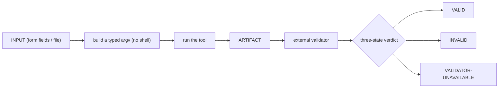
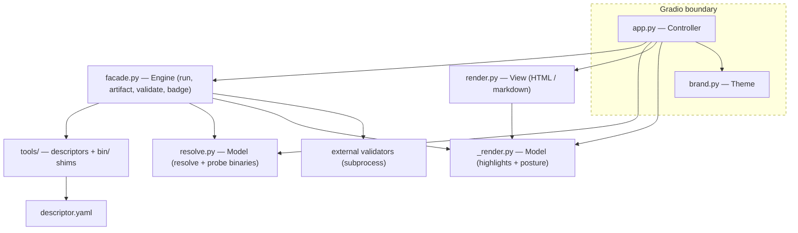

<!-- SPDX-FileCopyrightText: 2026 BreachSAFE <https://www.breachsafe.io> -->
<!-- SPDX-License-Identifier: Apache-2.0 -->
# Architecture

EnXemble is a small MVC around a rendering engine and a theme layer. This page explains the
module map and why the pieces are split the way they are. For the settled decisions, see
[ADR-0001](../adr/0001-breachsafe-wizard.md) and
[ADR-0002](../adr/0002-host-descriptor-boundary.md).

## The pipeline every tab shares

Every tool the host wraps is the same pipeline with different nouns:



The value of the host is that this pipeline is written once and shared by every tab, and that
the verdict is the real result of an external validator, reported as one of three states — never
a green the validator did not give.

## Module map

| Module | Role | Imports Gradio? |
|---|---|---|
| `resolve.py`, `_render.py` | **Model** — resolve descriptors, build the render model | no |
| `render.py` | **View** — turn the model into view structures | no |
| `app.py` | **Controller** — wire model → view into the running app; the Gradio shell | yes |
| `facade.py` | **Engine** — load descriptors, build argv, run, validate, derive the badge | no |
| `brand.py` | **Theme** — branding and white-label tokens | yes |

**Only `app.py` and `brand.py` import Gradio.** The framework dependency is kept at the
controller and theme edge; the model, view, and engine stay framework-free so they are testable
in isolation without a browser. That edge is explained in detail in
[the Gradio shell](the-gradio-shell.md).

## Component coupling

How the modules depend on one another. An arrow reads "uses / depends on"; the dashed box is the
Gradio boundary — everything inside it imports the framework, everything outside stays
framework-free.



Reading the graph:

- **`facade.py` (engine)** loads descriptors from `tools/`, resolves and runs each tool through
  `resolve.py`, invokes the external validator as a subprocess, and derives the badge. It carries
  no knowledge of any specific tool.
- **`app.py` (controller)** is the only caller that ties everything together: it calls the engine
  to run a descriptor, `resolve.py` for the environment probe, and the view plus `_render.py` to
  build the surface — and it imports the theme from `brand.py`.
- **`resolve.py`, `_render.py`, `render.py`** have no dependency on the controller or on Gradio, so
  they are unit-testable on their own.

## The engine

`facade.py` is the engine and carries no knowledge of any specific tool. It loads descriptors,
builds a typed argv (values are single argv elements, never a shell string, so an input can never
become a command), runs the tool by the chosen [execution backend](../reference/execution-backends.md),
runs the external validator, and derives the [three-state badge](../reference/badge.md). It is
the ~85%-backend part of the system and the place the correctness properties live.

## The shell

`app.py` is the Gradio shell. It maps a parameter type to a widget once, then loops over the
loaded descriptors to build one tab per standalone tool. Adding a tool changes no code here —
the tab is generated from the [descriptor](../reference/descriptor-schema.md). It also handles
the `--check` environment probe (see the [CLI reference](../reference/cli.md)).

## Repository layout

```
src/breachsafe_ux/   facade.py (engine), resolve.py + _render.py (model), render.py (view),
                     app.py (controller / Gradio shell), brand.py (theme)
tools/<id>/          <id>.yaml descriptor, optional bin/ run shim
docs/adr/            architecture decision records
tests/               badge-state and safety tests
```

Because the framework lives only at the edge and the engine is tool-agnostic, the same host
serves any tool that can be described by a descriptor. That agnosticism is the design thesis —
see [why agnostic](why-agnostic.md).
