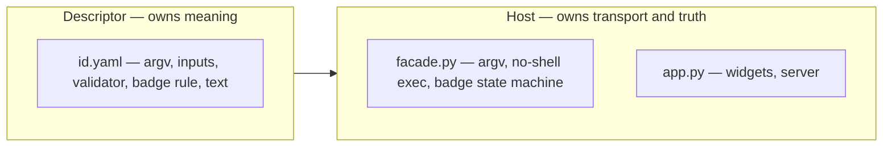

<!-- SPDX-FileCopyrightText: 2026 BreachSAFE <https://www.breachsafe.io> -->
<!-- SPDX-License-Identifier: Apache-2.0 -->
# The host↔descriptor boundary

The single invariant that keeps EnXemble generic: **the host owns transport and truth; the
descriptor owns meaning.** This page explains the boundary and why it is enforced as a hard
rule. The settled decision is [ADR-0002](../adr/0002-host-descriptor-boundary.md).

## What each side owns

| Layer | Owns | Must never contain |
|---|---|---|
| **Host** (`facade.py`, `app.py`) | how a tool is run and reported: argv assembly, no-shell exec, timeouts, the three-state badge state machine, server bind, widget rendering | the name of any specific tool, protocol, algorithm, CLI flag, or domain verdict |
| **Descriptor** (`<id>.yaml`) | what the tool means: its argv, inputs, validator, badge rule, headline text, connection test, chains | Python, exec logic, or anything that would need a host code change to add a new tool |

## The test for any host change

**A new tool must plug in with only a new YAML file.** If a change to the host is needed to
support a new tool, that change is on the wrong side of the boundary. The host stays free of any
tool's name, protocol, algorithm, flag, or domain verdict; all of that is descriptor data.

## Why it is a hard invariant

A config-driven host only stays generic if tool-specific meaning cannot leak into the engine.
The moment the engine "knows" about one tool — hardcodes a flag, computes a domain posture, or
reads an artifact to decide a headline — every future tool has to fit that assumption, and the
host quietly stops being reusable. Keeping the boundary hard means hardening and bug-fixes land
on the correct side rather than eroding reuse.

This is why, for example, the host renders only the badge **state** it can defend. Any
domain-specific summary a tab shows is declared by that tool's descriptor and mapped over the
badge state or an artifact value — the host never computes it. See
[the three-state verdict](three-state-verdict.md) and [why agnostic](why-agnostic.md).

## Standing witnesses

The shipped reference descriptors are kept as living pressure-tests of the boundary: they are
tools of different shapes (one produces its artifact on stdout with a format-selected validator
and a connection test; another takes a file input, uses a Docker-based validator, and is a chain
target). A change that needs host code to support either shape is a boundary violation, caught by
the tests. See [ADR-0002](../adr/0002-host-descriptor-boundary.md) for the full contract,
including the descriptor extensions (`validate.by`, per-state `render.headline`, descriptor-driven
connection tests, optional artifacts) that keep meaning in the descriptor.
