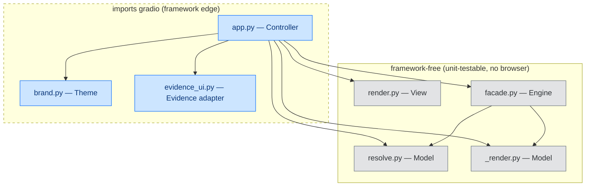

<!-- SPDX-FileCopyrightText: 2026 BreachSAFE <https://www.breachsafe.io> -->
<!-- SPDX-License-Identifier: Apache-2.0 -->
# The Gradio shell

EnXemble renders its web UI with **Gradio**, an Apache-2.0 Python framework for building web
interfaces from declarative widget code. This page explains what Gradio is, why it fits a
descriptor-driven EnXemble host, and, most importantly, how the host keeps the framework
dependency at a single edge so the rest of the code stays framework-free and unit-testable. For
the module map as a whole, see [architecture](architecture.md); for the invariant that keeps the
engine generic, see [the host↔descriptor boundary](host-descriptor-boundary.md).

## What Gradio is, and why it fits an agnostic host

Gradio turns Python objects into web widgets: a `gr.Textbox` is a text field, a `gr.Checkbox` is
a toggle, a `gr.Dropdown` is a select, and a `gr.Button` wired with `.click(fn, inputs, outputs)`
runs a Python function and streams the result back to the browser. There is no separate frontend
to build, bundle, or ship.

That declarative model is exactly what a config-driven host needs. Because a widget is created by
calling a constructor, the host can decide **at runtime** which widgets to build by reading a
tool's descriptor. The form for an arbitrary tool is a loop over that tool's declared inputs, not
hand-written markup. The host owns one thin shell; each tool is data. This is what lets a new tool
be a YAML file rather than new UI code (see [why the host is agnostic](why-agnostic.md)).

## The framework lives at one edge only

The host keeps Gradio at the UI edge. The controller, theme, and evidence presentation adapter
are the only modules that import `gradio`; execution and validation remain outside that boundary.

- `app.py` (**Controller**) builds the `gr.Blocks` app, maps input types to widgets, and wires the
  Run button to the engine.
- `brand.py` (**Theme**) builds the `gradio.themes` object and CSS.
- `resolve.py` and `_render.py` (**Model**), `render.py` (**View**), and `facade.py` (**Engine**)
  never import Gradio. They take and return plain Python, so they can be tested directly without a
  running server or a browser.

An `import-linter` gate enforces this layering, and [coding rules](../contributors/coding-rules.md)
restate it as a rule for contributors: new run or render logic belongs in the engine or model, not
in the shell.

## The type→widget map, written once

`app.py` declares the mapping from a descriptor input's `type` to a Gradio component exactly once,
then loops over every descriptor's inputs to build its tab. Adding a tool reuses this map; it never
extends it.

| Descriptor `type` | Gradio component | Notes |
|---|---|---|
| `text` | `gr.Textbox` | the default; required inputs get a ` *` label suffix |
| `int`, `float` | `gr.Number`, or `gr.Slider` when the input sets `widget: slider` | `int` uses `precision=0` |
| `bool` | `gr.Checkbox` | |
| `enum` | `gr.Radio` for up to three choices, else `gr.Dropdown` | radios keep few options all-visible |
| `file` | `gr.File` | the hint folds into the label (see below) |

Because the map is central, every tool inherits the same widget behaviour, labels, and hints, and
a change to how one type renders applies everywhere at once.

## Theming and white-label

The look is the `brand.py` theme layer: the product name, colour ramp, `gradio.themes` object, and
injected CSS all live there, so re-skinning the host is a single-module edit rather than a hunt
across the app. Because `brand.py` is the only other module that imports Gradio, the framework
dependency stays contained even for theming. The full recipe is
[white-label the branding](../how-to/white-label-branding.md).

## Gradio's edges to know about

- **`gr.File` yields a filepath string.** In Gradio 6 a file input returns the uploaded file's
  path as a plain string, like every other widget returns its value, so the host treats it as an
  ordinary argv value with no special handling (#101).
- **`gr.File` has no `info=` hint.** Unlike the other widgets, a file input folds its hint into the
  label text instead.
- **Long-running work uses `gr.Progress` and a queue.** The app calls `demo.queue()` and passes a
  `gr.Progress` handle so a scan that takes tens of seconds shows progress and a busy Run button
  rather than appearing to hang. This is the ceiling recorded in
  [ADR-0001](../adr/0001-breachsafe-wizard.md): a long scan needs explicit progress feedback.
- **Theming is "good, not pixel-perfect."** ADR-0001 also records that Gradio theming gets the host
  a clean, on-brand surface but not arbitrary pixel-level control; that trade is accepted in
  exchange for owning only a thin shell.

## Why this split matters

Keeping Gradio at the controller and theme edge is what makes the rest of the system portable and
testable. The engine's correctness properties, no-shell argv, fail-closed validation, the
[three-state verdict](three-state-verdict.md), are written and tested against plain Python, with
no browser in the loop. If the UI framework were ever swapped, the model, view, and engine would be
unaffected; only the shell and theme would change.
