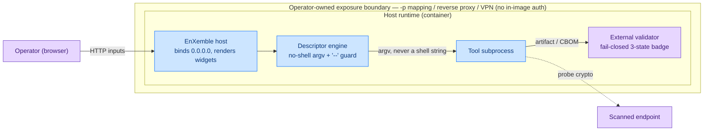

<!-- SPDX-FileCopyrightText: 2026 BreachSAFE <https://www.breachsafe.io> -->
<!-- SPDX-License-Identifier: Apache-2.0 -->
# The threat model

This page explains, in prose, the threat model the host is built to. It is the companion to the
machine-readable [`threat-model/threagile.yaml`](../../threat-model/threagile.yaml) and the
trust-boundary decision in [ADR-0002](../adr/0002-host-descriptor-boundary.md). The posture is
deliberately thin and operator-owned: reaching the UI equals reaching a process spawner, so
exposure is a deployment decision, and the host spends its hardening on the execution path
instead. This is a host-level model: it describes the generic UX host, not any one tool.

## The trust boundary is the operator's, not the host's

The host carries **no in-image authentication** ([ADR-0002 §3](../adr/0002-host-descriptor-boundary.md)).
The boundary that protects the UI is the operator's:

- **Loopback by default.** A local run binds `127.0.0.1`, reachable only from the same machine.
- **The container binds `0.0.0.0` on purpose.** Inside the shipped image the host binds all
  interfaces so the operator can map the port with `-p`. The trust boundary is then the container
  network namespace plus the operator's explicit `-p` mapping, reverse proxy, or VPN, not code in
  the host.
- **Auth belongs at the boundary you already run.** When you expose the UI, put authentication on
  the reverse proxy, Docker network, or VPN in front of it. The host does not add in-process Basic
  Auth or host-header middleware, and it does not refuse to start on a non-loopback bind (that
  would break the Docker default).

The reasoning: an in-process auth layer adds code and fights the Docker `0.0.0.0` norm for little
gain on a local, single-operator surface. If a hosted, multi-tenant surface is ever built, auth
belongs in that control plane (ADR-004 Phase 4), not in this single-tool host.

## Host ↔ descriptor trust posture

The host owns transport and truth; the descriptor owns meaning
([ADR-0002 §1](../adr/0002-host-descriptor-boundary.md)). That split is also a security boundary,
because the descriptor is what decides which command runs.

- **Descriptors are the highest-integrity asset.** A per-tool YAML declares the argv template, the
  input bindings, the validator, and the badge rule, so a tampered descriptor changes the command
  the host executes. Descriptors are in-repo and reviewed; their integrity is rated critical, their
  confidentiality only internal (they are declarations, not secrets).
- **Operator input is data, never code.** Form-field values are carried as argv elements. They are
  never assembled into a shell string.

## The hardened execution path

Because exposure is out of the host's hands, the host hardens what it does control: how a tool is
run and how its result is reported.

- **No-shell argv.** The engine execs a descriptor-declared argv **list** directly; it never invokes
  a shell. A field value containing shell metacharacters is passed as one literal argument, so there
  is no shell for it to be interpreted by.
- **End-of-options `--` guard.** The engine emits all options first, then a literal `--`, then
  positionals ([ADR-0002 §2d](../adr/0002-host-descriptor-boundary.md)). A field value beginning
  with a dash can no longer be smuggled to the underlying tool as a flag.
- **Fail-closed validation.** The result badge is a three-state machine,
  `valid` / `invalid` / `none`, driven by an external validator. If no validator applies to the
  produced artifact, the badge is `none`, never a green
  ([ADR-0002 §2b/§2c](../adr/0002-host-descriptor-boundary.md)). A run without a validator, or with
  an unhandled format or exit code, can never render as a passing verdict. The full rationale is in
  [why the verdict has three states](three-state-verdict.md).
- **Pinned tool image.** When the local tool binary is not on `PATH`, an optional Docker fallback
  runs the tool from a **digest-pinned** official image (ADR-0003). In the shipped `qureddy-ux`
  image the local binary always resolves, so this path is not exercised.

## The trust boundaries, drawn

The operator reaches the host across the operator-owned exposure boundary. Everything the host
spawns, the descriptor engine, the tool subprocess, and the external validator, lives inside the
container runtime; the tool subprocess reaches out to the scanned endpoint to probe its
cryptography.

## The accepted operator-boundary risks

The model records the operator-boundary posture as **accepted** risk, so it reads as a conscious
decision rather than an unhandled gap. Both entries come straight from the `risk_tracking` block of
[`threat-model/threagile.yaml`](../../threat-model/threagile.yaml):

| Risk (Threagile) | Status | Why it is accepted |
|---|---|---|
| Missing authentication (operator → host) | `accepted` | Operator-boundary trust posture ([ADR-0002 §3](../adr/0002-host-descriptor-boundary.md)): loopback bind by default; exposure and authentication are the operator's `-p` / reverse proxy / VPN. In-image auth is wontfix for this single-operator local host (#7, #22). |
| Missing authentication second factor (operator → host) | `accepted` | Same posture: with no in-image auth there is no second factor in this host either (ADR-0002 §3; #7/#22 wontfix). |

These are the only two tracked risks, and both are `accepted`. The current model generates no
high- or critical-severity risks at all.

## How the Threagile gate enforces this

The model is checkable in CI. On any pull request that touches `threat-model/**`, the
[Threagile gate](../../threat-model/README.md) runs Threagile in a digest-pinned container to
validate the model and emit `risks.json`, then runs
[`scripts/threagile_gate.py`](../../scripts/threagile_gate.py), which **fails the build on any
high- or critical-severity risk whose status is `unchecked` or `in-discussion`**. Risks tracked as
`accepted`, `mitigated`, `in-progress`, or `false-positive` pass. Because the two authentication
risks above are `accepted` and nothing else is high or critical, the gate is green.

The gate is **advisory today**: its two steps carry `continue-on-error` until the Threagile
container run is proven on the CI runner (#134). Making it blocking is that follow-up's job; the
model and the gate script are already verified locally.

## Related reading

- [ADR-0002: the host ↔ descriptor boundary](../adr/0002-host-descriptor-boundary.md): the source
  decision this model encodes.
- [`threat-model/README.md`](../../threat-model/README.md): how to regenerate and validate the
  model locally, and how the CI gate is wired.
- [Why the verdict has three states](three-state-verdict.md): the fail-closed badge in depth.
- [The host ↔ descriptor boundary](host-descriptor-boundary.md): the boundary as a design thesis.
