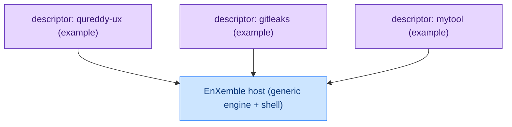

<!-- SPDX-FileCopyrightText: 2026 BreachSAFE <https://www.breachsafe.io> -->
<!-- SPDX-License-Identifier: Apache-2.0 -->
# Why the host is agnostic

EnXemble is a generic host: the engine wraps **any** command-line tool, and each tool is a
plugin described by one YAML file. This page explains why that design was chosen over building a
UI per tool. The settled decision is [ADR-0001](../adr/0001-breachsafe-wizard.md).

## Every tool is the same pipeline

Look at almost any command-line tool through a UI and the shape is identical: take some input,
run the tool, produce an artifact, check the artifact, show the result. The nouns change — a
scanner, a linter, a converter, a secret finder — but the pipeline does not. Building a bespoke
UI for each tool re-implements that same pipeline every time, and each copy drifts: one handles a
missing dependency, another does not; one reports a real verdict, another shows an optimistic
green.

## The thesis: host is generic, tools are plugins

So the host is written once and the tool is data:

- **The engine is tool-agnostic.** It builds the argv, runs the tool, validates the output, and
  derives the badge without knowing any tool's name, protocol, flag, or domain meaning.
- **A tool is a descriptor.** Adding or changing a tool is a YAML file, not new UI code. The
  renderer, the runner, and the badge are shared by every tool tab.

The correctness properties — no-shell argv, fail-closed validation, the three-state verdict — are
then written and tested **once**, and every tool inherits them. That is only possible if the
engine never learns about a specific tool, which is why the
[host↔descriptor boundary](host-descriptor-boundary.md) is a hard invariant.

One generic host, many descriptor plugins — each an example of the same contract:

## What agnostic buys

- **Near-zero UI code per tool.** A new tab is a descriptor; there is no per-tool UI to write,
  review, or maintain.
- **Uniform, auditable verdicts.** Every tool reports the same three states by the same rule, so
  a verdict means the same thing everywhere and is auditable as data.
- **White-labelling and editions for free.** Because the identity is one theme module and tabs
  are gated by feature flags, one build serves many brands and editions without forking. See
  [white-label branding](../how-to/white-label-branding.md) and
  [enable optional tabs](../how-to/enable-optional-tabs.md).

## What it is not

The host wraps a **single tool per tab** and, at most, hands one artifact to another tab via a
declared chain. Multi-tool orchestration — DAGs, batch runs, scheduling, run history — is
deliberately out of scope; that belongs to an orchestration layer, not to this host. Keeping the
scope to "one tool, done well" is what lets the host stay small enough to be generic. See
[execution backends](../reference/execution-backends.md).

## The shipped reference example

The packaged `qureddy-ux` image is one example of the host with a specific tool's descriptors
bundled in. It is a demonstration of the host, not the host's subject: the host itself knows
nothing about that tool, and any other tool wraps the same way. To wrap your own, see
[add a tool](../how-to/add-a-tool.md).
