<!-- SPDX-FileCopyrightText: 2026 BreachSAFE <https://www.breachsafe.io> -->
<!-- SPDX-License-Identifier: Apache-2.0 -->
# Add a tool (write a descriptor)

EnXemble wraps any command-line tool from **one YAML descriptor**. You write no UI code: the
host reads the descriptor, renders a form, builds a typed argv (never a shell string), runs the
tool, hands the output to an external validator, and shows the three-state badge. Adding a tool
is data, not code.

This guide wraps a generic third-party CLI — the secret scanner
[`gitleaks`](https://github.com/gitleaks/gitleaks) — to show the host is tool-agnostic. Nothing
here is specific to any BreachSAFE tool. The full field list is the
[descriptor schema reference](../reference/descriptor-schema.md); the argv tokens are the
[descriptor tokens reference](../reference/descriptor-tokens.md).

> The YAML blocks below are **illustrative configuration**, not shell commands. Adapt the flag
> names and validator to the tool you are wrapping.

The lifecycle you are wiring up — one descriptor becomes a rendered tab, a run, and a verdict:

```mermaid
flowchart LR
    yaml["descriptor.yaml"] --> tab["rendered tab (widgets)"]
    tab --> run["Run: typed argv -> tool"]
    run --> artifact["artifact"]
    artifact --> validate["external validator"]
    validate --> badge["three-state badge"]
    classDef valid       fill:#d4edda,stroke:#28a745,color:#155724;
    classDef invalid     fill:#f8d7da,stroke:#dc3545,color:#721c24;
    classDef unavailable fill:#fff3cd,stroke:#fd7e14,color:#7a4a00;
    classDef process     fill:#cce5ff,stroke:#0d6efd,color:#0a3678;
    classDef artifact    fill:#e2e3e5,stroke:#6c757d,color:#2f3336;
    classDef external    fill:#e7d6ff,stroke:#6f42c1,color:#3d1a78;
    class tab,run,badge process;
    class yaml,artifact artifact;
    class validate external;
```



## 1. Create the descriptor file

One tool is one file at `tools/<id>/<id>.yaml`, where `<id>` is a lowercase slug. For our
example:

```
tools/gitleaks/gitleaks.yaml
```

Point the host at this directory with `BREACHSAFE_UX_TOOLS_DIR`, or drop it under the bundled
`tools/` directory.

## 2. Declare the inputs

Each input becomes a form widget and maps to argv by **exactly one** of `positional: true`,
`arg: "--x"` (emits `--x value`), or `flag: "--x"` (emits `--x` only when truthy). An input with
none of those is a token-only value you reference as `{name}` elsewhere.

```yaml
schema_version: 1
id: gitleaks
title: "Secret scan (gitleaks)"
run_label: "Scan for secrets"
standalone: true
description: >
  Scans a directory for committed secrets with gitleaks and validates the JSON report.
inputs:
  - name: source
    type: text
    label: "source directory"
    default: "."
    info: "Path to scan."
    required: true
    arg: "--source"
  - name: redact
    type: bool
    label: "redact secrets in the report"
    default: true
    flag: "--redact"
    group: advanced
```

Widget types are `text`, `int`, `float`, `bool`, `enum` (radio for up to three choices, dropdown
for more), and `file`. Put rarely-used inputs in `group: advanced` to place them behind a
collapsible section.

## 3. Declare how the tool runs

`run.base` is the fixed command prefix; the host appends the inputs' argv, then a literal `--`,
then any positionals. Tell the host where the artifact comes from — a file the tool writes, or
its captured stdout.

```yaml
run:
  base: [gitleaks, detect, --report-format, json, --report-path, "{share}/report.json", --exit-code, "0"]
  artifact_name: report.json
  timeout_s: 120
```

`{share}` is the per-run working directory the host creates. Setting gitleaks' own
`--exit-code 0` keeps a "secrets found" result from being read as a tool crash — the finding
belongs in the artifact and the validator, not in a nonzero exit. If your tool writes the
artifact itself (as here), omit `run.artifact_from`; to use the tool's stdout as the artifact,
set `run.artifact_from: stdout`.

To run the tool from a container instead of a `PATH` binary, add `run.image:
zricethezav/gitleaks:latest`; the host runs the local binary when it resolves and falls back to
the image otherwise. See [execution backends](../reference/execution-backends.md).

## 4. Declare the validator and badge rule

The badge is an **external** check, not the tool's own opinion. Point it at the artifact and map
its result to a state. Fail-closed: anything that is not a clear pass or a clear reject becomes
`unavailable`, never a green.

```yaml
validate:
  argv:
    - "{python}"
    - -c
    - "import json,sys; d=json.load(open('{artifact}')); sys.exit(0 if isinstance(d,list) else 1)"
  timeout_s: 30
  badge_rule:
    pass_if: { exit: 0 }
    fail_if: { exit: 1 }
    otherwise: unavailable
```

`{python}` is the interpreter running the host, not a bare `python` that might be absent, and
`{artifact}` is the report path. A real validator would check the report against a schema; this
one just proves the report parses. If a validator's applicability depends on an input value, use
`validate.by` / `cases` to select one per value and badge `none` where none applies — see the
[descriptor schema reference](../reference/descriptor-schema.md).

## 5. Optional: render, actions, chains

```yaml
render:
  primary: json
  highlights:
    - { label: "findings", find_prop: "0.RuleID" }
  badge_text:
    valid: "Evidence: report is well-formed JSON"
    invalid: "Evidence: report failed to parse"
    unavailable: "Evidence: validator could not run"
```

`actions` add descriptor-declared buttons (each runs its own argv and shows OK/FAIL), and
`chains` hand this tool's artifact to another descriptor's tab. Both are in the
[descriptor schema reference](../reference/descriptor-schema.md).

## 6. Load it

Restart the host with the descriptor in place, then confirm the tool and validator resolve:

```bash
BREACHSAFE_UX_TOOLS_DIR=tools uv run breachsafe-ux --check
```

`--check` prints the tool, validator, and their paths for each tab and exits nonzero if any is
missing. When it passes, launch the host and your new tab is there — with no change to any host
code.
