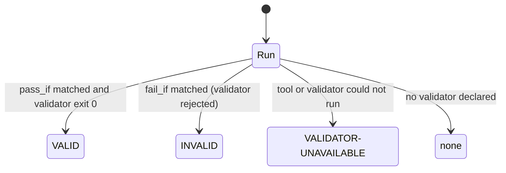

<!-- SPDX-FileCopyrightText: 2026 BreachSAFE <https://www.breachsafe.io> -->
<!-- SPDX-License-Identifier: Apache-2.0 -->
# The three-state badge

The badge is the host's verdict on a run. It reports the result of an **external validator**,
never a guess, and it has exactly the states below. For the reasoning behind fail-closed
behaviour, see [the three-state verdict](../explanation/three-state-verdict.md); for how a
descriptor configures it, see [descriptor schema](descriptor-schema.md#validate).

## States

| State | Meaning |
|---|---|
| `VALID` | The validator ran and accepted the artifact. |
| `INVALID` | The validator ran and rejected the artifact. |
| `VALIDATOR-UNAVAILABLE` | The tool or the validator could not run (missing dependency, Docker down, timeout, empty output). |
| `none` | The descriptor declares no external validator for this run (an explicit opt-out). |

A crashed tool, a missing validator dependency, or an empty run all resolve to
`VALIDATOR-UNAVAILABLE`, never to `VALID`. Colour is a redundant cue only; the word carries the
state as text.

## How a state is derived

The state comes from the descriptor's `validate.badge_rule` applied to the validator's output:

- `pass_if` met → `VALID`
- `fail_if` met → `INVALID`
- `unavailable_if` met → `VALIDATOR-UNAVAILABLE`
- otherwise → the `otherwise` fallback

Each condition is an AND over any of `exit`, `stdout_contains`, `stdout_contains_any`, and
`stdout_not_contains`. **Fail-closed:** an empty or unmatched condition never passes, and a
`validate.by` case with no validator badges `none` rather than a green.

## Badge text vs. domain meaning

The host defends only the badge **state**. A descriptor may reword each state with
`render.badge_text` so a green badge states what was checked (for example "Evidence: report is
well-formed") rather than implying a security verdict, and may show a separate `render.posture`
banner for a finding it reads out of the artifact. The host never computes a domain verdict — see
[the host↔descriptor boundary](../explanation/host-descriptor-boundary.md).
