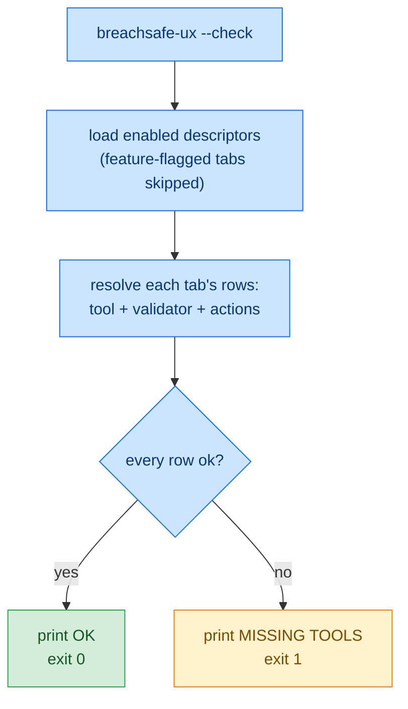

<!-- SPDX-FileCopyrightText: 2026 BreachSAFE <https://www.breachsafe.io> -->
<!-- SPDX-License-Identifier: Apache-2.0 -->
# CLI reference

The host is a web application with one command, `breachsafe-ux`. It has two behaviours: launch
the server (the default), or resolve the environment and exit (`--check`). There is **no**
`--help` or `--version` subcommand. The host is a web UX, not a CLI tool.

## `breachsafe-ux`

Builds the app (a tab per standalone descriptor) and launches the Gradio server.

```bash
uv run breachsafe-ux
```

- Binds `BREACHSAFE_UX_HOST` (default `127.0.0.1` from source, `0.0.0.0` in the Docker image) on
  `BREACHSAFE_UX_PORT` (default `7860`).
- Serves until interrupted. See the
  [environment variables reference](environment-variables.md) for all configuration.

Passing any argument other than `--check` still launches the server; unrecognised flags are not
parsed as options. Only the literal token `--check` is intercepted, so `--help`, `--version`, and
any other flag fall through to a server launch.

## `breachsafe-ux --check`

Resolves every loaded descriptor's environment, prints a per-tab table, and exits nonzero if any
tool or validator is missing. This is the real health signal: a `curl` on `/` is false-healthy
because the web server serves even when the underlying tool is absent.

```bash
uv run breachsafe-ux --check          # from a source checkout
docker exec enxemble breachsafe-ux --check   # inside a running container
```

For each tab it prints a Markdown table with one row per role, the tool, the validator, and any
connection-test command, showing the resolved binary, version, and path, plus a per-row status.
It ends with a summary line: `OK` or `MISSING TOOLS`.

### Example

Running `--check` inside a container where every declared tool resolves:

```
## qureddy
| role | binary | version | path | status |
|---|---|---|---|---|
| tool | qureddy | 0.2.40 | /usr/local/bin/qureddy | ok |
| validator | python | 3.14.7 | /usr/local/bin/python3.14 | ok |
| Test connection | openssl | 3.5.7 | /opt/openssl/bin/openssl | ok |

## qureddy-ssh
| role | binary | version | path | status |
|---|---|---|---|---|
| tool | qureddy | 0.2.40 | /usr/local/bin/qureddy | ok |
| validator | python | 3.14.7 | /usr/local/bin/python3.14 | ok |
| Test connection | ssh-keyscan | - | /usr/bin/ssh-keyscan | ok |

OK
```

The `qureddy` and `qureddy-ssh` tabs are one deployment's example descriptors; the exact tabs,
tools, versions, and paths depend on the descriptors loaded and the host they run on.

## Exit behavior

The two behaviours exit differently. `--check` is a one-shot probe with a defined exit code; a
plain launch runs until stopped.

| Invocation | Exit code | When |
|---|---|---|
| `breachsafe-ux` (launch) | `0` | The server was started and later shut down cleanly (for example `Ctrl-C`). |
| `breachsafe-ux` (launch) | non-zero | The server could not start: the web framework raises (for example the port is already in use), which propagates as a non-zero exit. The host does not assign this code itself. |
| `breachsafe-ux --check` | `0` | Every loaded tab's tool and validator resolved. The summary line is `OK`. |
| `breachsafe-ux --check` | `1` | At least one row is missing. The summary line is `MISSING TOOLS`. |

`--check` only inspects the tabs that are **loaded**. A tab gated off by a feature flag is not
checked, so hiding an optional tab whose tool you have not installed keeps `--check` green. For
example `BREACHSAFE_UX_MINT_OSCAL=false` skips the mint-oscal tab entirely. See
[enable optional tabs](../how-to/enable-optional-tabs.md).

### Per-row status categories

Each row in the `--check` tables carries exactly one of two statuses. The overall exit code is
driven by whether any row is `NOT FOUND`.

| Status | Meaning | Effect on exit |
|---|---|---|
| `ok` | The binary for this role (tool, validator, or connection-test command) resolved on `PATH`, or the declared Docker image can be used because `docker` is present. | Keeps the run green. |
| `NOT FOUND` | The binary for this role did not resolve on `PATH` and no usable Docker fallback exists. | Forces the summary to `MISSING TOOLS` and the exit code to `1`. |

A missing validator is reported the same way as a missing tool: a validator row with status
`NOT FOUND`. This per-row `ok` / `NOT FOUND` status is the resolver's install-time view and is
distinct from the runtime [three-state badge](badge.md) (`VALID` / `INVALID` /
`VALIDATOR-UNAVAILABLE`), which is a single scan's verdict, not a health probe.

### `--check` flow


