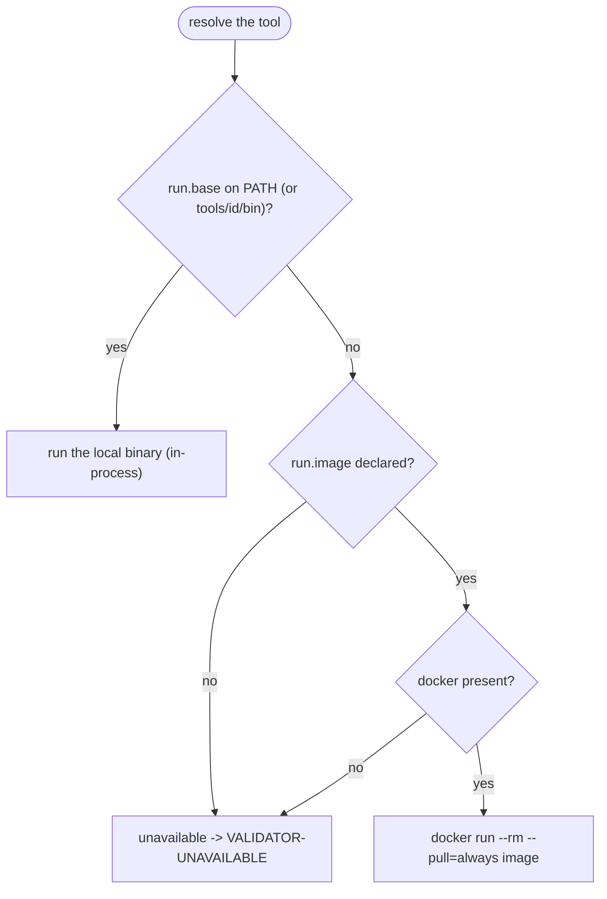

<!-- SPDX-FileCopyrightText: 2026 BreachSAFE <https://www.breachsafe.io> -->
<!-- SPDX-License-Identifier: Apache-2.0 -->
# Execution backends

A descriptor chooses how its tool runs. The "could not run" path is shared by every backend, so
a backend that cannot run yields `VALIDATOR-UNAVAILABLE` rather than a false verdict.

| Backend | Descriptor field | Portable | Isolated | Status |
|---|---|---|---|---|
| Local binary | `run.base` (or `run.argv`) on `PATH` | no | no | supported (preferred when present) |
| Docker image | `run.image` (`docker run --pull=always`) | yes | yes | supported |
| Remote API | `run.endpoint` | yes | yes | future |

The host resolves the backend fail-closed: a local binary is preferred, the image is the fallback,
and anything that cannot run yields `VALIDATOR-UNAVAILABLE`.

## Local binary

The host runs the command named in `run.base` / `run.argv` by resolving it against
`tools/<id>/bin/` first, then the system `PATH`. This is the preferred backend when the tool is
present: no Docker, in-process, fastest. See [`tools/README.md`](../../tools/README.md) for the
per-developer shim mechanism.

## Docker image

When a descriptor declares `run.image`, the host runs the tool from that image with
`docker run --pull=always <image>`. `--pull=always` keeps the tool current; pin by digest
(`@sha256`) instead of `:latest` when reproducibility matters more than freshness.

## Local-then-image fallback

A descriptor may declare **both** `run.base` and `run.image`. The host runs the **local binary
when it resolves on `PATH`**, and falls back to the **Docker image** otherwise. This lets one
descriptor serve both local development (the binary) and a Docker deployment (the image) without
change. In a self-contained tool-UX image where the binary is always present, the image path is
not exercised.

## The argv model

Whatever the backend, the host builds a **typed argv, never a shell string** — each input value
is a single argv element, so a value can never become a command. Options are emitted first, then
a literal `--`, then positionals, so a leading-dash value cannot be parsed as a flag. A tool
whose parser does not support `--` opts out with `run.no_end_of_options: true` (a weaker
posture). See [descriptor tokens](descriptor-tokens.md) for the substitution namespace.

## Out of scope

Multi-tool orchestration, DAGs, batch runs, and run history are deliberately not part of the
host; that is the role of an orchestration layer. A descriptor may hand a single artifact to
another descriptor via a `chains` button, but the host is not a workflow engine. See
[why agnostic](../explanation/why-agnostic.md) and
[ADR-0001](../adr/0001-breachsafe-wizard.md).
