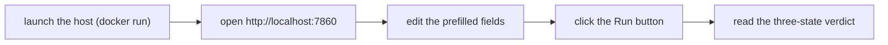

<!-- SPDX-FileCopyrightText: 2026 BreachSAFE <https://www.breachsafe.io> -->
<!-- SPDX-License-Identifier: Apache-2.0 -->
# Your first run (and how to read the verdict)

A five-minute walkthrough of the generic flow every EnXemble tab follows: launch the host, run
a tool against an input, and read the three-state verdict correctly. No configuration required.

We use the **shipped reference example** image, `qureddy-ux`, because it is the packaged product
you can pull today. What you learn here is the host flow, not the scanner — every tab, whatever
tool it wraps, works the same way.

The flow end to end:



## 1. Launch

```bash
docker rm -f $(docker ps -aq --filter publish=7860) 2>/dev/null   # clear any previous run on :7860
docker run -d --pull=always -p 7860:7860 --name enxemble ghcr.io/paul007ex/qureddy-ux:latest
sleep 10 && open http://localhost:7860       # macOS  ·  Linux: xdg-open  ·  Windows: start
```

Your browser opens on the host. This image is self-contained (the wrapped tool and its runtime
are inside), so there is nothing else to install. The last line is the macOS `open`; on Linux
use `xdg-open http://localhost:7860` and on Windows `start http://localhost:7860`.

## 2. Run the tool

1. You land on the first tab. Its input fields are prefilled with a working example, so you can
   run immediately.
2. Click the tab's run button. The host builds a typed argv from the fields (never a shell
   string), runs the tool, captures the output as an artifact, and hands that artifact to an
   external validator.
3. To use your own input, edit the fields and run again. Every other tab behaves identically.

The shipped example tabs wrap a post-quantum readiness scanner; for what those specific scans
mean, see the [`breachsafe/qureddy` documentation](https://github.com/breachsafe/qureddy). This
tutorial stays with the host flow that is the same for any tool.

## 3. Read the verdict — the three-state badge

The badge is the point of the host. It reports the result of an **external validator**, never a
guess, and it has exactly three states:

| Badge | What it means | What it does NOT mean |
|---|---|---|
| **VALID** | The validator ran and accepted the artifact. | — |
| **INVALID** | The validator ran and rejected the artifact. | Not "the tool crashed." |
| **VALIDATOR-UNAVAILABLE** | The tool or validator could not run (missing dependency, Docker down, timeout, empty output). | **Never** a pass in disguise. |

The rule that matters: a crashed tool, a missing validator, or an empty run resolve to
**VALIDATOR-UNAVAILABLE** — they are never shown as VALID. Colour is only a redundant cue; the
word carries the state. If you see green, a real validator really accepted a real artifact. See
[the three-state verdict](../explanation/three-state-verdict.md) for why the host fails closed.

Some tools add a plain-language summary line above the badge. That summary is the tool's own
finding declared in its descriptor, not something the host computes — the host only defends the
badge state.

## 4. Where the artifact goes

Each run writes to a unique per-run directory under `~/mint-proof/wizard-runs` (override with
`BREACHSAFE_UX_RUN_ROOT`). The artifact there is what the validator reads to derive the badge,
and what you can archive or feed downstream.

## 5. Verify the environment

To confirm every tab's tool and validator resolve before you rely on a result:

```bash
docker exec enxemble breachsafe-ux --check     # exit != 0 if any tool/validator is missing
```

This prints, per tab, the exact binary, version, and path in use for each role (tool, validator,
and any connection-test command) — the same provenance shown greyed-out inside each tab's
**Advanced** section. Stop the host with `docker stop enxemble`.

## Next steps

- Wrap your own tool as a one-file YAML descriptor: [add a tool](../how-to/add-a-tool.md).
- Look up the tokens you can use in a descriptor's argv: [descriptor tokens](../reference/descriptor-tokens.md).
- Understand the host/descriptor boundary: [host↔descriptor boundary](../explanation/host-descriptor-boundary.md).
